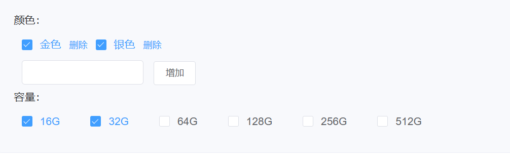
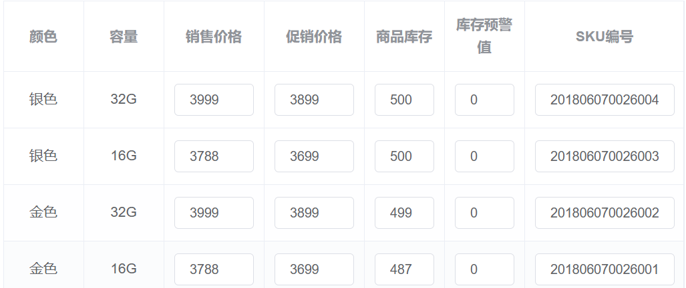
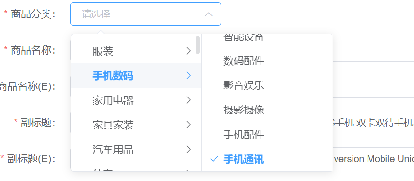
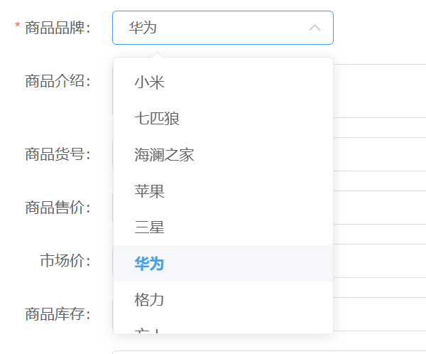
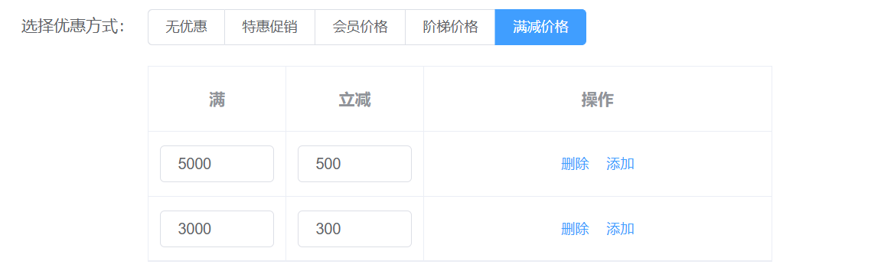
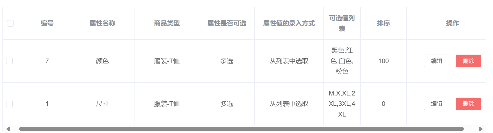
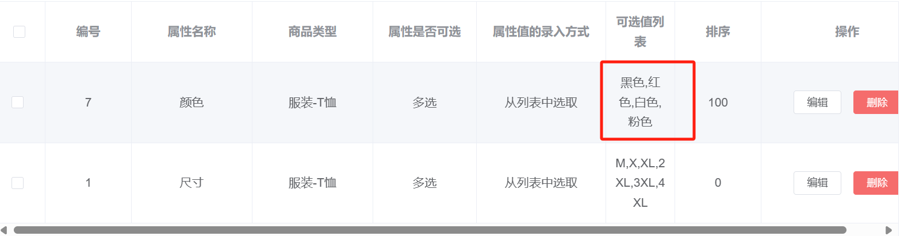
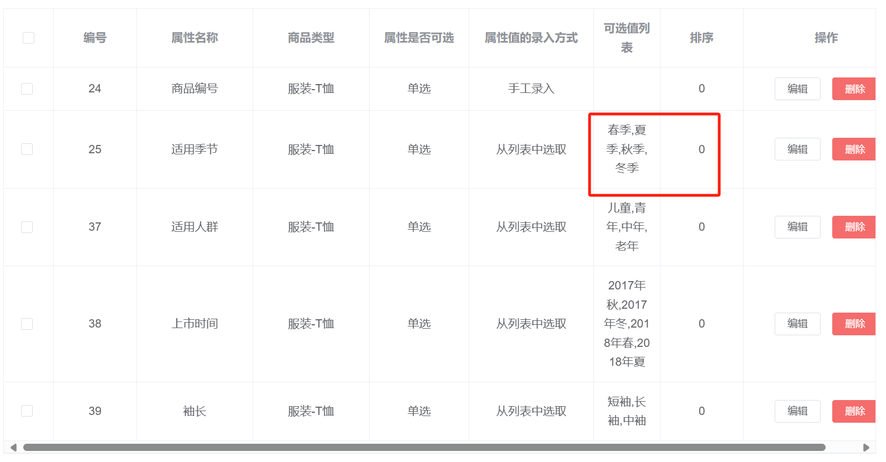
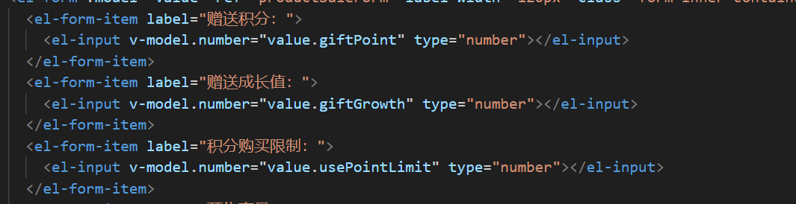

# mall-admin-web

## 添加商品属性及 locale 处理 

- 首页/商品/修改商品
  - 填写商品属性
    - 属性类型 
      目前只支持中文
    - 商品规格 项
      添加 locale 支持即 增加 locale 为 En 的属性描述
      
    - sku 项修改
      
    - 商品参数项修改
          
    - 商品详情
      增加 电脑端详情  locale == en 部分 
      增加 移动端详情  locale == en 部分
  - 商品信息  修改
    - 商品分类 
    - 商品品牌   需要修改 
  - 商品促销
    - 优惠方式   需要修改支持 locale == en 的情况

## 添加商品类型属性 及 locale 处理 

- 首页/商品/商品属性
  - 属性值可选值列表
    - 增加 locale == en 的 列表
    - 
  - 商品属性列表
    - 增加 input_list_en 展示
    - 
    - 
  - 商品参数列表
    - 

## 添加商品 Sku 相关编辑选项 （未添加）

- 增加 sku 页面
  - 列表 sku
  - 编辑 sku 库存/ 属性修改 

## 添加数据分析页面 （未添加）

- 增加 统计信息 页面
  - 编辑 sku 库存/ 属性修改 

## order Detail 页面修改 

- 商品信息项 
  - 增加 商品 name_en
  - 增加 属性 En  

## el-loader 添加 authorization

~~~html

    <el-upload
      :action="useOss?ossUploadUrl:minioUploadUrl"
      :data="useOss?dataObj:null"
      list-type="picture"
      :multiple="false" :show-file-list="showFileList"
      :file-list="fileList"
      :before-upload="beforeUpload"
      :on-remove="handleRemove"
      :on-success="handleUploadSuccess"
      :on-preview="handlePreview"
      :headers="customHeader" 
      >
      <el-button size="small" type="primary">点击上传</el-button>
      
只能上传jpg/png文件，且不超过10MB

    </el-upload>
  

~~~

## 输入值问题
需指定 input 的 model.number ，才能转化为 int 型 

## 日期选择器 

~~~html
<el-date-picker
  v-model="dateTime"
  type="datetime"
  placeholder="选择日期时间"
  value-format="yyyy-MM-dd'T'HH:mm:ss'Z'"
  format="yyyy-MM-dd HH:mm:ss">
</el-date-picker>

~~~

